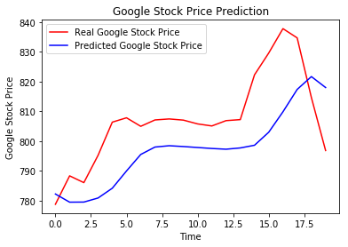

# Google Stock Price Prediction

Image above display trends of **Predicted Stock Price and Real Stock Price**

## Results

- Parts which contains some spikes,predictions lags behind by actual values, coz the model couldn't react to **fast non-linear changes**

- For the part of predictions containing smooth changes,model reacts pretty well and manages to follow the **upward and downward trends**
